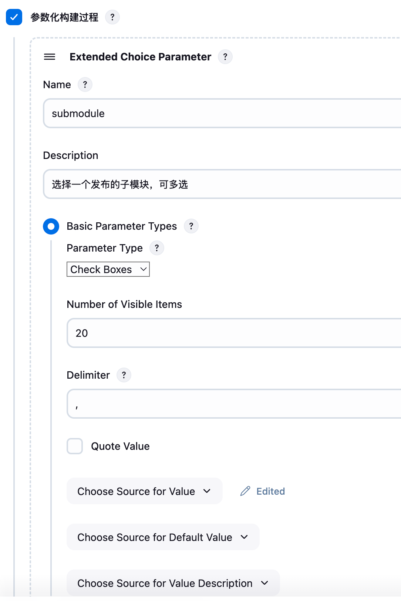
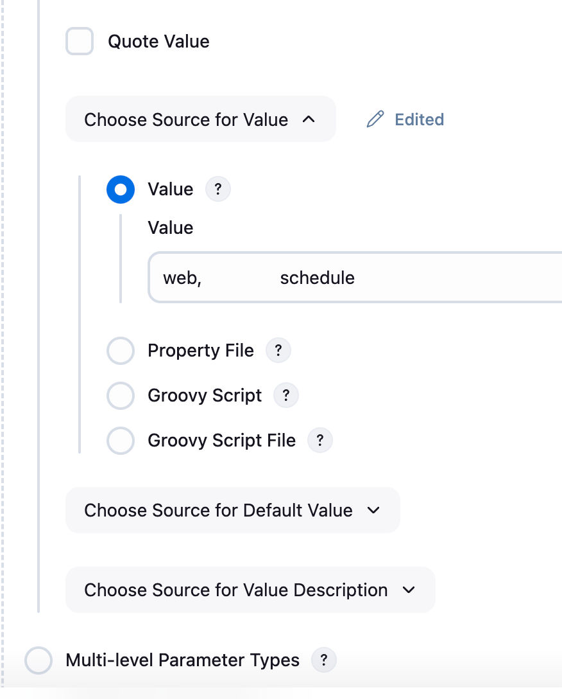
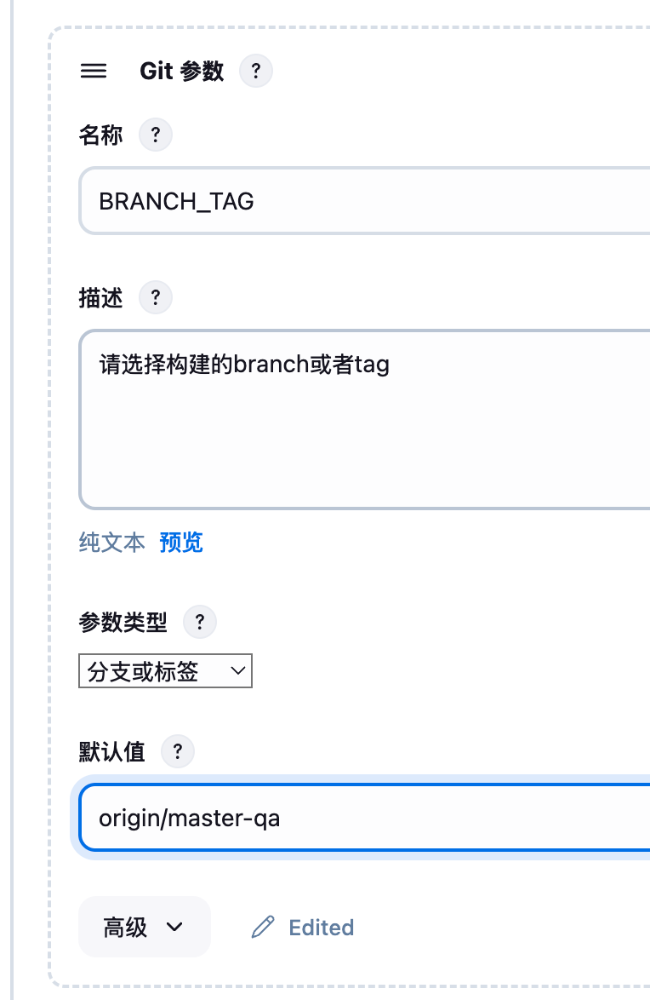
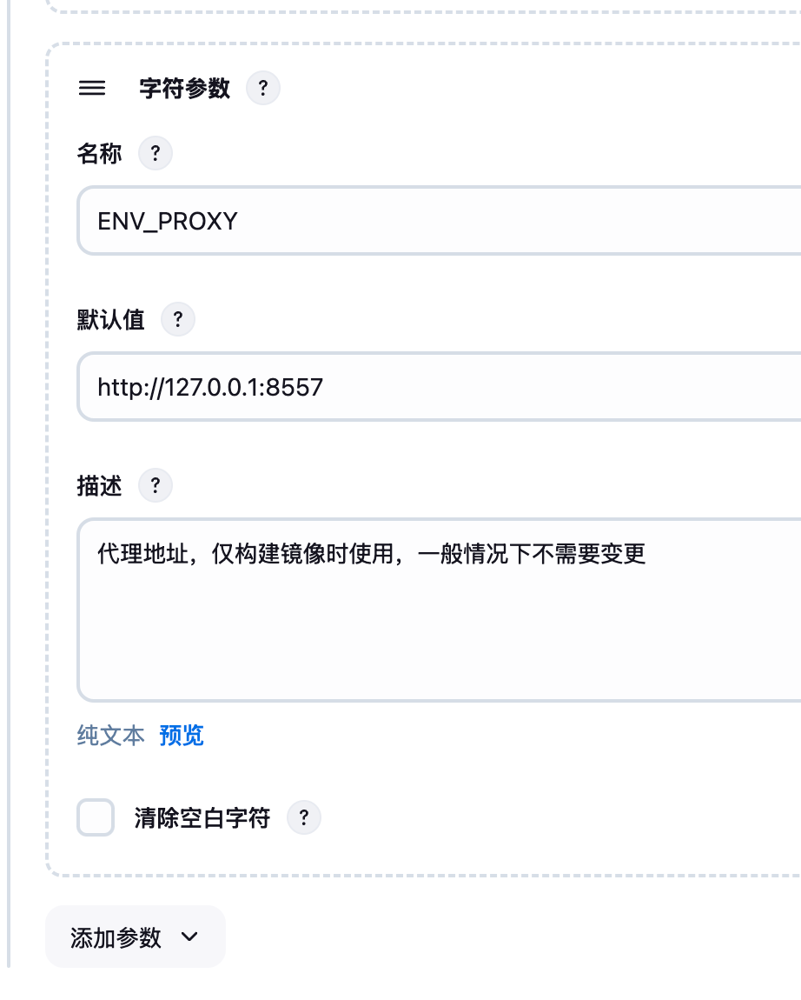
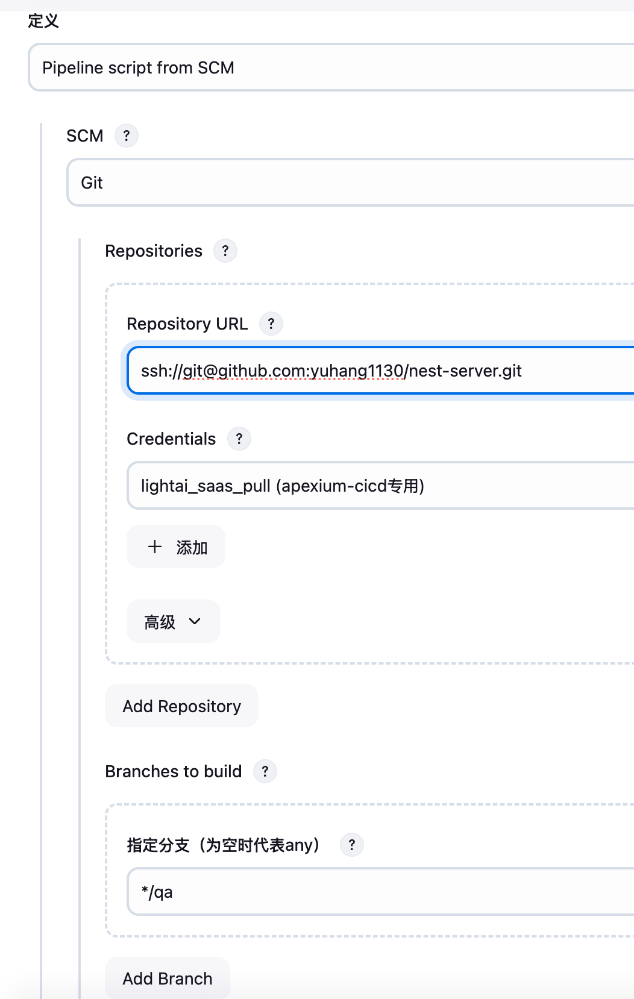
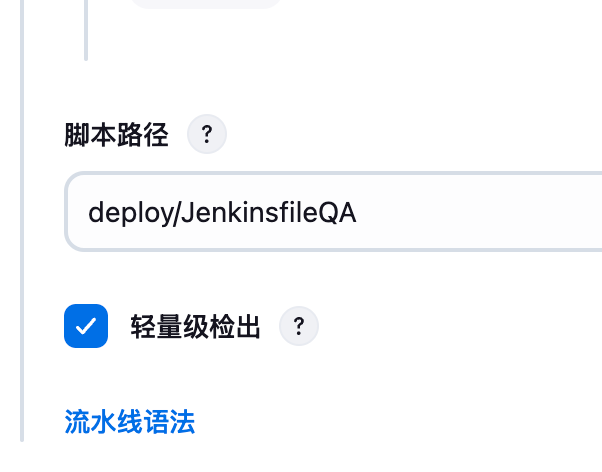

# 基于nestjs框架基座，集成mysql，mongodb，redis，用户中心服务，支持k8s微服务模块部署

```bash 设置淘宝镜像源
npm config set registry https://registry.npmmirror.com --global
npm install
```

## Running the app

```bash
# development
$ npm run start

# watch mode
$ npm run start:dev

# production mode
$ npm run start:prod
```

## Test

```bash
# unit tests
$ npm run test

# e2e tests
$ npm run test:e2e

# test coverage
$ npm run test:cov

## 微服务架构

```bash
# 接口服务(web)根目录运行：
$ npm run start:dev

# 定时服务(schedule)根目录运行：
# 方式一：
$ npm run start:dev
$ cd src/script && ts-node schedule-demo.ts

# 方式二：
$ npm run start:dev
$ cd dist/script && node schedule-demo.js
```

# jenkins安装一个多选框插件：<https://cloud.baidu.com/article/3291425>











